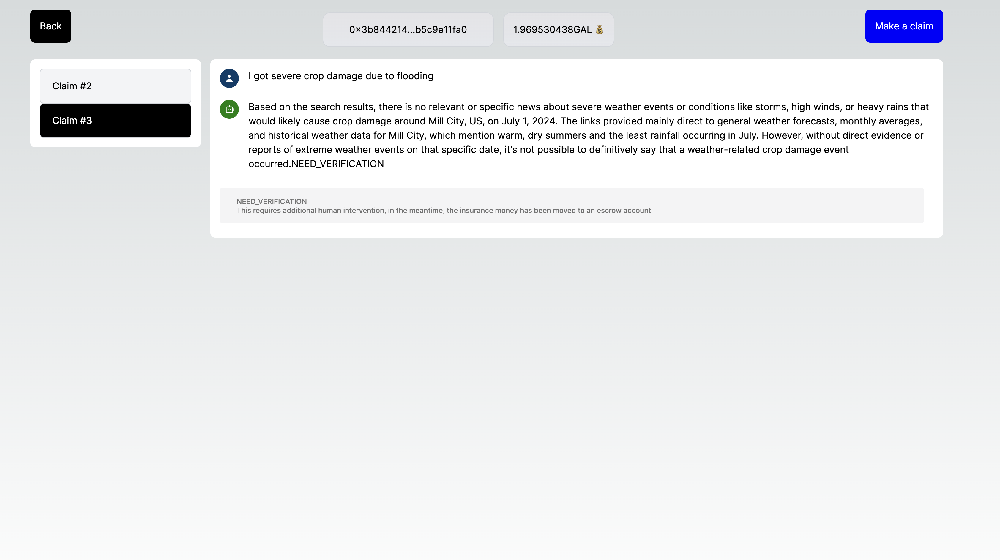

# Galadriel Climate insurance application

## Summary

This service provides dynamic adjustments to insurance premiums based on real-time severe weather conditions. By integrating weather data from various sources, the service calculates and adjusts insurance premiums to reflect the current risk level for a specified location. The premium adjustments are executed on the blockchain for transparency and immutability.

## Context

The proposed service is an advanced climate insurance platform for farmers. It leverages real-time weather data and predictive analytics to dynamically calculate and adjust daily premiums. Farmers are insured based on the weather conditions affecting their land. An API aggregator, execute calls around the hour to forecast weather conditions around the farmer's parcel and submits this data to a smart contract built on the Galadriel blockchain. That smart contract agent would predict the daily premium that gets updated hourly and the premiums forecasted for the following days. Having access to a personalized historical knowledge RAG, the agent could make more predict estimation and therefore allow fair prices for farmers.
An ideal scenario would be to have a smart account wallet that allows daily payments without human interventions, based on preset settings of the farmer. Daily payments would be automatic, but the system could notify of an increase in premium and whether or not to pay that premium based on the most recent forecasts.

Farmers gain fair and transparent pricing, as premiums are based on actual risk, with automated daily payments reducing financial strain and operational hassle. They receive real-time weather forecasts and predictive analytics, enabling better risk management and informed decision-making, while notifications for premium changes provide peace of mind. Insurance providers benefit from accurate risk assessments using real-time data, leading to precise premium adjustments and operational efficiency through automated processes. This fosters enhanced customer trust and satisfaction, as transparent calculations and fair pricing are evident.

## Features

- Real-Time Weather Data: Fetches up-to-date weather information to assess risk.
- Dynamic Premium Calculation: Adjusts insurance premiums based on weather conditions.
- Blockchain Integration: Executes premium adjustments on the blockchain for transparency.
- Fraud proof climate claims: Executes and flags insurance fraud on the blockchain.




## Technologies

- Galadriel Oracles/Blockchain
- NextJs
- React
- Prisma
- Postgres database
- Docker

## Future Enhancements

- [ ] smart wallets
- [ ] custom RAG per user/location
- [ ] notification system

## Getting Started

First, run the development server:

- Node 20.14
- Install Postgres

```bash
yarn install
yarn run dev

npx prisma init
npx prisma migrate dev --name init
npx prisma generate

docker compose up
```

## Learn More

To learn more about the datasources:

- [XWeather](https://www.xweather.com/docs/weather-api/endpoints/stormcells-summary) - External Weather API
- [SPC Weather Service - Storm](https://www.spc.noaa.gov/products/outlook/) - have a look here to see various weather forecasts and select a location to test the APIs.
- [SPC Weather Service - Fire](https://www.spc.noaa.gov/products/fire_wx/) - an interactive Next.js tutorial.
