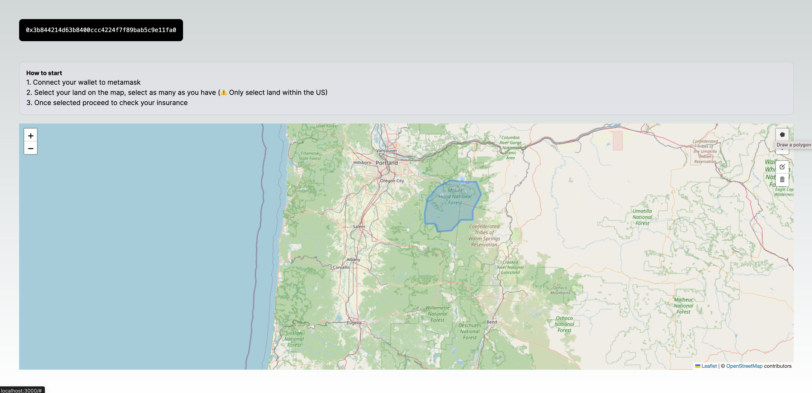
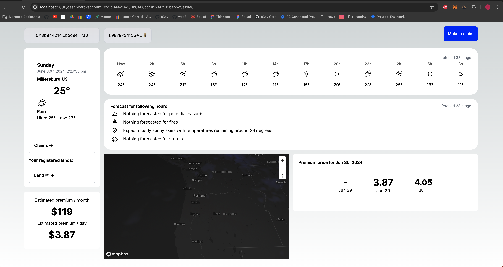

# Galadriel Climate insurance application

## Summary

This service provides dynamic adjustments to insurance premiums based on real-time severe weather conditions. By integrating weather data from various sources, the service calculates and adjusts insurance premiums to reflect the current risk level for a specified location. The premium adjustments are executed on the blockchain for transparency and immutability.

## Features

- Real-Time Weather Data: Fetches up-to-date weather information to assess risk.
- Dynamic Premium Calculation: Adjusts insurance premiums based on weather conditions.
- Blockchain Integration: Executes premium adjustments on the blockchain for transparency.
- Fraud proof climate claims: Executes and flags insurance fraud on the blockchain.




## Technologies

- Galadriel Oracles/Blockchain
- NextJs
- React
- Prisma
- Postgres database
- Docker

## Getting Started

First, run the development server:

- Node 20.14
- Install Postgres

```bash
yarn install
yarn run dev

npx prisma init
npx prisma migrate dev --name init
npx prisma generate

docker compose up
```

## Learn More

To learn more about the datasources:

- [XWeather](https://www.xweather.com/docs/weather-api/endpoints/stormcells-summary) - External Weather API
- [SPC Weather Service - Storm](https://www.spc.noaa.gov/products/outlook/) - have a look here to see various weather forecasts and select a location to test the product.
- [SPC Weather Service - Fire](https://www.spc.noaa.gov/products/fire_wx/) - an interactive Next.js tutorial.
